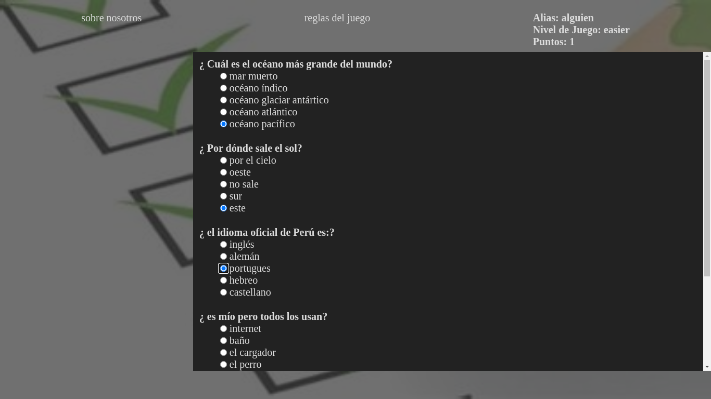

# sofka

Es un cuestionario para un desafío training

# Descripción

La dinámica es resolver un set de cinco preguntas durante cinco rondas y guardar el avance de cada usuario o jugador 

# Características 

La interación de la bd con el proyecto funciona lento es recomedable esperar 6 segundos por interacción

# Stack

Nodejs Mysql css y javascript

# Developer server

npm start, npm build 

# architecture api with front-end

-api

 --config
 
---db.js
  
--controllers
 
---controllers.js
   
--routers

---router.js

---server.js

-views

 --dashboard

---dashboard.css

---dashboard.html

---dashboard.js

--game

--public

--services

--app.js

--app.css

--index.html

-index.js

-package.json

# bd mysql

tables: user, category, test.

user => iduser, alias, idcategory

category => idcategory, name_category

test => idtest, question, res_one, res_two, rest_three, res_four, res_true idcategory

# Interacción

